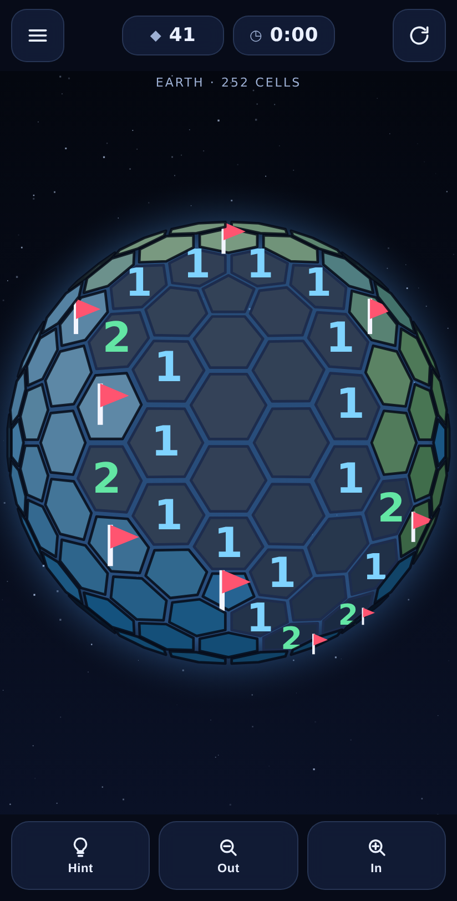

# Hexsphere

Minesweeper on a globe. The board is a sphere tiled with hexagons — plus the
twelve pentagons you cannot avoid when you close hexagons into a ball — so there
are no edges, no corners, and no safe border to start from. You spin the world
with a finger and sweep it clean.

A from-scratch rebuild of a globe minesweeper that disappeared from the Play
Store, written as a web app that installs to an Android home screen and runs
completely offline.



## What it does differently

| | |
|---|---|
| **Guaranteed solvable boards** | Every board is checked by a solver that only makes provable deductions before you ever see it. If the board would force a coin flip, it is rebuilt. Losing is always a misread, never bad luck. |
| **Hints that explain themselves** | The hint button points at a cell you could already have worked out and says *why* — "provably safe", "provably a mine", or "that flag is wrong". |
| **Exact odds when you do gamble** | Turn the guarantee off and, if a position really is ambiguous, the hint ranks the safest cell using exact probabilities computed over every consistent mine arrangement. |
| **Five worlds, not five numbers** | Each board size is a place. Pebble is rough warm rock, Moon is grey maria, Earth has continents and a blue atmosphere, Neptune is banded, Sun is a granulated star with a corona. The surface is computed from each cell's own position, so it is the same world every time you play that size. |
| **Casual mode** | One fatal tap can be stepped back, and the mine gets flagged for you. |
| **Daily challenge** | The same board for everyone, derived from the date, pre-opened at the same cell. |
| **Sizes from 92 to 4002 cells** | Five presets plus a custom board where you pick the cell count. Past about 1500 cells a board no longer fits legibly on one screen, so it becomes a game of zooming in and navigating around the sphere rather than reading the whole globe at once. A custom board borrows the world of the preset nearest its size, which means everything above 652 cells is currently the Sun — known, and written up in the backlog. |
| **Size and difficulty are separate** | How big a board is and how hard it is are two choices, so a quick hard board is possible. Gentle, Normal, Hard and Insane each set the mine density *and* how much the first click may hand you — a quarter of the safe cells down to a tenth — because a hard board that opens a quarter of itself is not hard. The first three densities are the classic beginner, intermediate and expert ratios converted for a sphere, where every cell has six neighbours instead of eight and the same density therefore leaves far more cells with nothing next to them: 12.3/15.6/20.6% become 16/20/26%. Insane, at 32%, is past anything square minesweeper offers, and past the density at which a guess-free board can always be built — so it will sometimes hand you one that needs a guess, and say so. |
| **Reads well for everyone** | Three themes including a high-contrast one with an Okabe–Ito number palette that stays distinguishable with any common colour blindness, plus adjustable number size. |
| **Pentagons are marked** | The twelve five-neighbour cells are tinted, because a cell that touches five neighbours instead of six changes what its number means. |
| **No ads, no tracking, no network** | Nothing is sent anywhere. Once loaded the game never talks to the network again. |

## Play

Open `index.html` — no build step, no dependencies.

For the service worker (offline install) it needs to be served over HTTP rather
than opened from disk:

```sh
npx http-server . -p 8080     # then open http://localhost:8080/
```

## Getting it onto a phone

**As an installed web app.** Turn on GitHub Pages for this repository
(Settings → Pages → *Deploy from a branch*, `main`, `/`), then open
`https://andreashustad.github.io/Hexsphere/` in Chrome on the phone and choose
**⋮ → Add to Home screen**. It installs with its own icon, launches without
browser chrome, and works in aeroplane mode from then on. Long-press the icon
for shortcuts straight into the daily challenge or a new game.

**As an APK.** [`android/`](android) is an Android Studio project that wraps the
same files in a native shell — one WebView, no permissions at all (not even
`INTERNET`), assets served through `WebViewAssetLoader` so the game gets a
proper secure origin for its saved settings and records. Gradle gathers the web
app from the repository root at build time, so there is only ever one copy of
the game here.

```sh
cd android
./gradlew assembleDebug        # app/build/outputs/apk/debug/app-debug.apk
adb install -r app/build/outputs/apk/debug/app-debug.apk
```

The wrapper is committed, so this needs no Android Studio, only a JDK. If you
have Studio installed and no JDK on your PATH, its bundled one works:
`export JAVA_HOME="/Applications/Android Studio.app/Contents/jbr/Contents/Home"`.
The build writes `local.properties` pointing at your SDK; Studio creates it on
first sync, or write it yourself.

`compileSdk` tracks whichever platform is installed under
`$ANDROID_HOME/platforms/`, and `targetSdk` tracks Google Play's current floor
for new apps, which is published on Play's target API level requirements page
and moves every August. Check both before cutting a release rather than
trusting the numbers in `app/build.gradle` to still be right.

## Controls

| Action | Gesture |
|---|---|
| Spin the globe | Drag — it keeps coasting when you let go |
| Open a cell | Double tap |
| Flag a mine | Press and hold, or tap and let the ring close (right-click on desktop) |
| Open around a number | Tap a number whose flags are all placed |
| Zoom | Pinch, scroll, or the dock buttons |

Only covered cells are ambiguous, so only they wait to see whether a tap is the
first half of a double. A tap on a number opens around it straight away, the
open fires on the second tap rather than at the end of the window, and a press
held past that window skips it entirely — a second tap would have had to land
inside a window that went by while your finger was still down, so there is
nothing left to disambiguate. That leaves one gesture that has to wait, a quick
lone tap, and while it does the cell carries a ring that closes as the window
does, because an unacknowledged wait is what reads as lag. The ring is
deliberately not a faint flag: a flag drawn and then taken back would flash on
every cell you open, cascades included.

Keyboard: arrows spin, <kbd>+</kbd>/<kbd>-</kbd> zoom, <kbd>Space</kbd> opens the
centre cell, <kbd>F</kbd> flags it, <kbd>C</kbd> opens around it, <kbd>H</kbd>
hint, <kbd>N</kbd> new game, <kbd>Esc</kbd> closes the menu.

## How it works

**The board** (`js/geometry.js`) is a Goldberg polyhedron. An icosahedron is
subdivided `f` times, projected onto the unit sphere, and then dualised: every
vertex of that geodesic sphere becomes one playable cell. That yields exactly
`10f² + 2` cells, of which exactly twelve are pentagons, at any size — a tiling
with no poles and no seams, where every cell is very nearly the same size.

**The solver** (`js/solver.js`) escalates through three levels: single-constraint
saturation, the subset rule between overlapping numbers, and — when those stall —
an exhaustive search that splits the frontier into independent components and
enumerates every consistent mine arrangement. Arrangements are weighted by how
many ways the leftover mines fit in the cells nobody can see yet, computed in log
space, which gives exact per-cell probabilities. Cells at probability 0 or 1 are
certainties; everything else is a genuine guess.

**Generation** (`generateBoard`) scatters mines with the opening move and its
neighbours kept clear, then asks the solver to play the board. If logic alone
cannot finish it, a single mine is moved within the region the solver got stuck
in and it tries again — small local repairs, so the parts that already worked
survive. In practice a guess-free board is found in a handful of milliseconds
even at 4002 cells, where a guaranteed board takes about 4ms. Density is what
costs, not size: at 30% on 812 cells the solver spends 288ms and still fails to
find a guess-free layout, while 4002 cells at 19% is instant.

It also caps how much the first click may clear. The opening is always a zero
cell, because a guess-free board has to give the solver somewhere to start, so
it always cascades; on 92 cells that cascade used to hand over two thirds of the
board, and sometimes 96% of it, before you had read a single number. Moving
mines closer to the opening does not help, because the generator then rejects
those boards as unsolvable and draws another that cascades anyway: the guarantee
itself is what demands a generous opening. Capping the cascade — a quarter of the
safe cells on Gentle, down to a tenth on Insane — and drawing again costs about
a millisecond, because it only binds on the small boards, which are the cheap
ones to generate.

**The renderer** (`js/renderer.js`) is a small 3D engine on a plain 2D canvas:
quaternion orientation, a perspective camera, back-face culling (the sphere is
convex, so culling alone gives correct draw order) and per-cell diffuse shading.
Picking casts a ray onto the sphere and takes the nearest cell centre — the cells
*are* the Voronoi regions of their centres, so that is exact. No WebGL and no
libraries, which is what keeps the whole game a handful of small files.

**Bodies and themes** are deliberately separate axes. A body owns what you look
at: the covered surface, the sky, the halo and the direction of the light. A
theme owns what you read: the numbers, the revealed cells and the chrome. They
compose, so five worlds and three themes cost five palettes plus three rather
than fifteen. Value noise on the cell's own position gives each body its surface
(continents, craters, bands, granulation), computed once per board and scaled by
cell count so one treatment holds from 92 cells to 4002. A cleared cell keeps a
small trace of its body, or the art direction would fade out exactly as you play.
The high-contrast theme drops the body outright, because its palette exists to
stay readable with any common colour blindness and a planet painted over it would
undo that.

The one rule that constrains all of it is that a covered cell and a cleared one
are read *against each other*, so no palette can be judged on its own. Two
bodies had drifted until one end of their surface range landed on the tone of an
opened cell, and on those boards a cleared area could only be found by hunting
for numbers. The fill is therefore computed by one function the tests can call
without a canvas, and the suite sweeps every body against every theme across the
whole surface range. Cleared cells also carry their own rim colour rather than
the near-black grid the covered ones use, so the boundary you actually scan for
survives even where two fills come out close.

## Tests

```sh
node tests/run.js
```

Covers the tiling's topology (cell counts, exactly twelve pentagons, symmetric
adjacency, winding, connectivity), the solver's deductions and probability
arithmetic, the guarantee that generated boards really are guess-free, and the
game rules — cascades, flags, chording, wins, rewind, seeded boards, and the
promise that a hint never points at a mine it called safe.

It also covers the things that are only visible when you play: that every body
stays distinguishable from a cleared cell in every theme, that a tap on a
covered cell never flags one you meant to open and a held press never waits,
and that the reveal animation cannot run outside its own bounds — the cascade
stamps cells with times in the *future*, and unclamped easing once painted a
cell at 65x, mirrored through its own centre.

And delivery, against a fake Cache Storage and a fake network: that a pushed fix
reaches a browser which already has the game, that offline play survives a failed
refresh, and that an interrupted refresh can never leave half of one version
beside half of another. The fake network models a browser's per-host connection
limit, because without that it cheerfully passes a worker that deadlocks on a
real one.

## Layout

```
index.html              app shell
styles.css              chrome (the board itself is canvas)
manifest.webmanifest    installable app metadata
sw.js                   offline cache
js/util.js              RNG, vector and quaternion maths
js/geometry.js          Goldberg sphere construction
js/solver.js            deduction, probabilities, board generation
js/game.js              game state: reveal, flag, chord, hint, rewind
js/renderer.js          canvas 3D renderer
js/input.js             touch, mouse and keyboard
js/storage.js           settings, records, daily history
js/main.js              menus, HUD, game loop
android/                Android Studio project wrapping the web app
tests/run.js            test suite
tools/make-icons.js     renders every icon from the real board geometry
```

`tools/make-icons.js` renders the web, Apple touch and Android launcher icons —
the globe in them is the actual board geometry, so the icons cannot drift out of
sync with the game.
